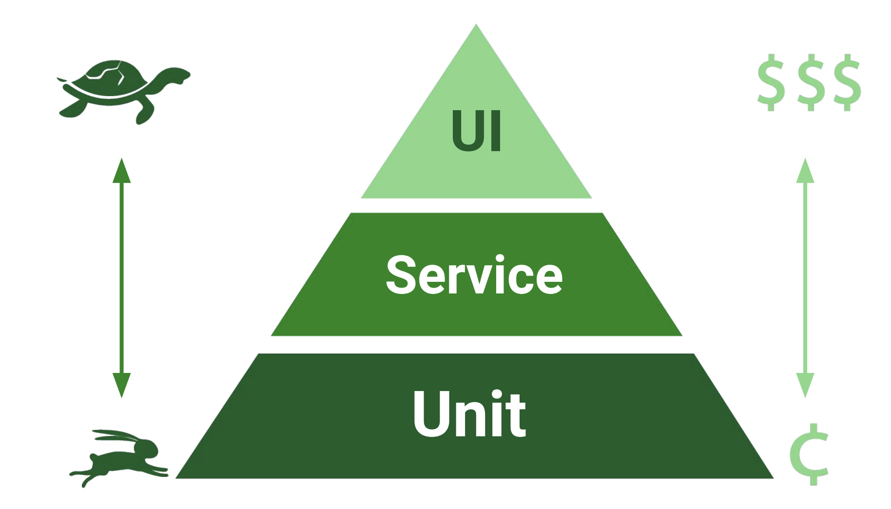
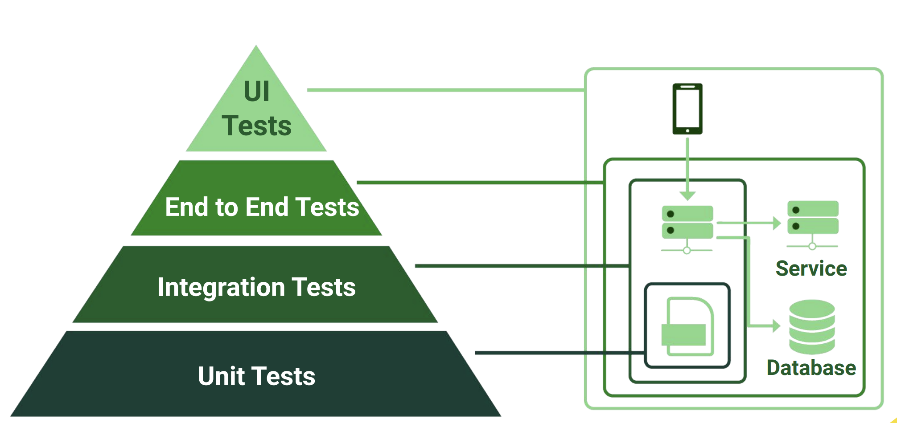
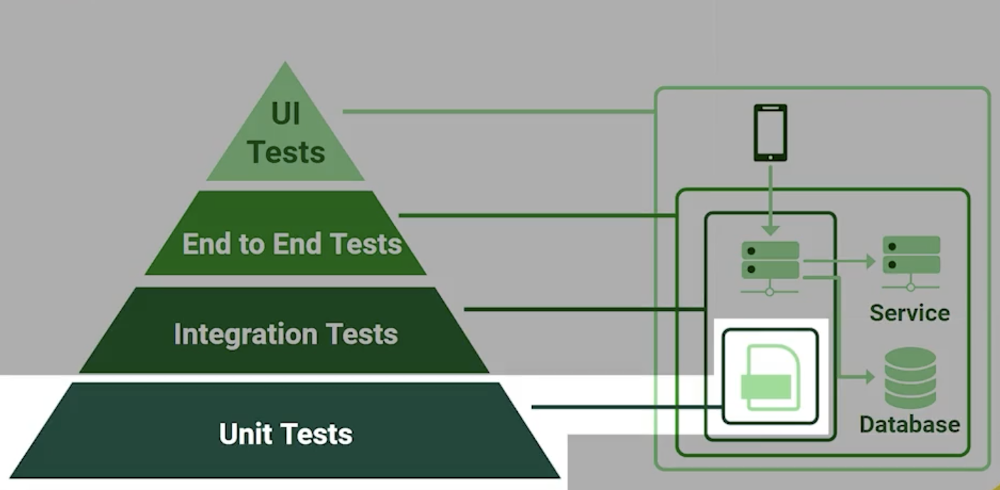
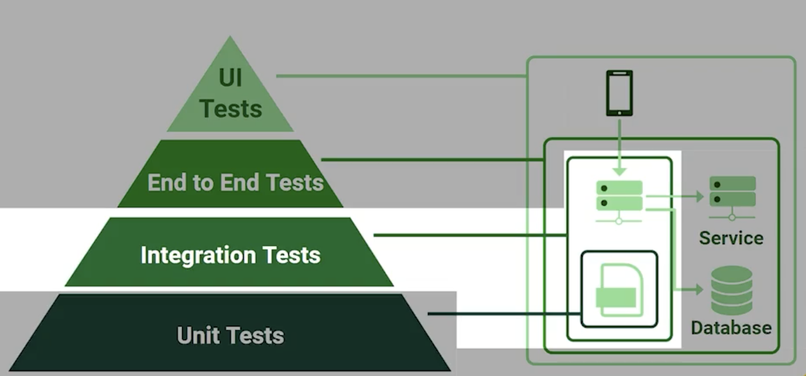
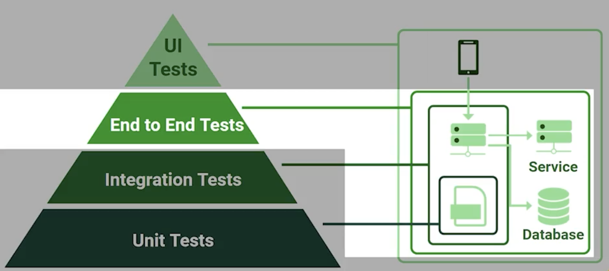
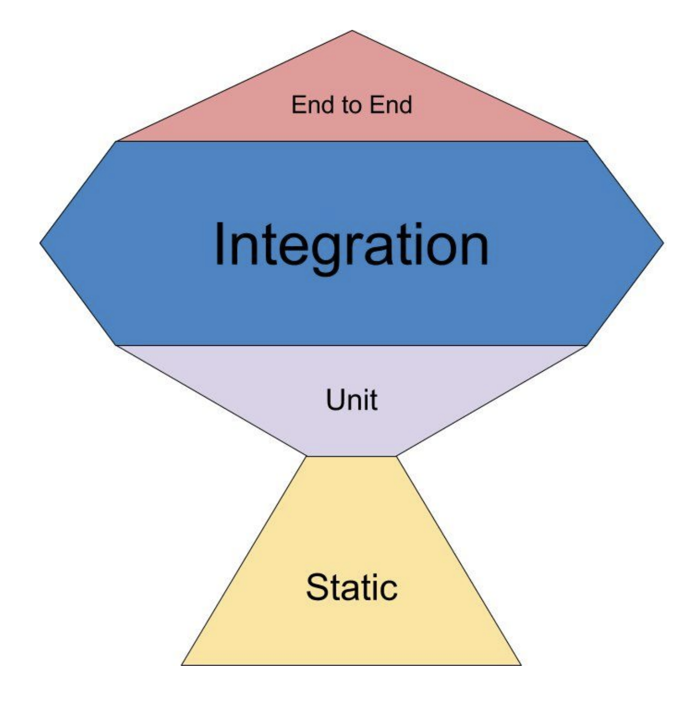
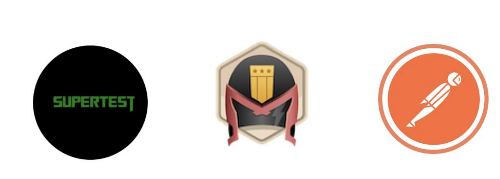
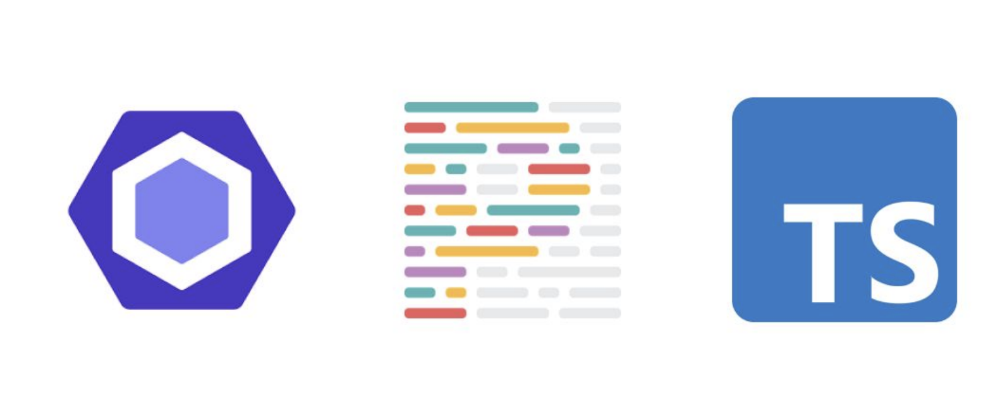

# ¿Qué es el testing?

En el mundo actual las tecnologias con las que vivimos necesitan codigo, esto ha hecho que el desarrollo de software se haya vuelto industrial, donde contamos con procesos y herramientas, como el testing, que nos permiten entregar mas rapido proyectos de calidad a nuestros clientes reduciendo el riesgo de errores en produccion.

## ¿Por que hacer testing?
Normalmente hay cuatro fases en el desarrollo de software para crear un producto:

Diseño ⇒ Desarrollo ⇒ Pruebas ⇒ Produccion

En estas fases, detectar un error se vuelve cada vez mas costoso. Ahi es donde hacemos tecnicas para prevenir estas situaciones. El testing es la manera en la que nosotros gestionamos el riesgo y tratamos de evitar, en la medida de lo posible, los errores en el sistema.

### Gestionar riesgos como Google
1. **Analisis de codigo estatico:** Mientras desarrollamos vamos viendo nuestros resultados.
2. **Pruebas unitarias:** Nos aseguramos que el codigo funciona como queremos.
3. **Pruebas de integracion:** Verificar que varios elementos funcionan bien trabajando juntos.
4. **Revision de codigo:** Equipo o persona encargada de revisar el codigo de las demas personas.
5. **QA:** Equipos de creacion de pruebas automaticas o manuales.

¿Creamos testing para comprobar que el sofware funciona?
- No Podemos demostrar a ciencia cierta que el sofware funciona.
- No podemos entregrar un sistema libre de bugs

Lo que si es:
Los problemas siempre van a exister, lo que hacemos es gestionar el riesgo.
- Empezamos a cubrir de varios escenarios para validar entradas y salidas.

"Entre más temprano encontremos el error más facil será solucionarlo"
 Fase para gestionar el riesgo en diferentes escenarios por google:
 1. Static analysis - A medida que escribimos codigo nos da feedback, esta corre del lado del dev, y en el editor.
 2. Unit tests: No es tan instantaneo


# La piramide del testing

La pirámide clásica del testing: (de menos a más costoso y tendría que haber más pruebas de las primeras que de las últimas)


---
- unit tests
- integration tests
- end to end tests (e2e)
- ui test: emulan el dispositivo físico


---

---

---

---

# Trofeo del Testing
- Tronco - Analisis de código estatico
- buena base pero no es la mayoria - Unit tests
- Se recomienda tener más pruebas de integración 
- Minimas pruebas de e2e




# Herramientas y Clasificación


[State of JavaScript 2022](https://2022.stateofjs.com/en-US/)

Herramientas que se pueden encontrar a lo largo de los distintos niveles de testes son (backend y frontend):

- pruebas estaticas
- unit tests
- integration tests
- ui tests


- [Jest](https://jestjs.io/)
  - Tiene muy poca complejidad
  - Corre muy bien en distintos sistemas
- [Chai](https://www.chaijs.com/)
- [Mocha](https://mochajs.org/)
- [Ava](https://github.com/avajs/ava)
- [Jasmine](https://jasmine.github.io/)
---

# UI Testing
 Donde se despliega / emula los sistemas de forma autimatizada.

 - [Playwright](https://playwright.dev/) - Es un fork de puppetear pero solo enfocado a ui testing.
 - [Cypress](https://www.cypress.io/)
 - [WebdriverIO](https://webdriver.io/)
 - [Puppeteer](https://pptr.dev/) -  web scraping- performace

 

# API Testing

Las APIs no tienen una UI, si no utilizan un protocolo de comunicación.

- Supertest
- Dredd
- Postman

 

# Pruebas estaticas
Se caracterizan por no ejecutar el código como tal, normalmente se integran en nuestro edito de código.

- EsLint
- Prettier
- TypeScript 

 


**
Para estas herramientas algo a tener en cuenta es que manejan una sola estructura al momento de implementarlas, es decir, no tenemos que preocuparnos por el cambio a como se impelementan.
**

```js
// Test en Jest
describe("A suit is just a function", () => {
   let a
   test("and so is a spec", () => {
      a = true
      expect(a).toBe(true)
   })
})

```
```js
// Test en Jasmine
describe("A suit is just a function", () => {
   let a
   test("and so is a spec", () => {
      a = true
      expect(a).toBe(true)
   })
})
```

## Matchers // Assertions 

```js
// Test en Jest
test('null', () => {
   const n = null
   expect(n).toBeNull()
   expect(n).toBeDefined()
   expect(n).not.toBeUndefined()
   expect(n).not.toBeTruthy()
   expect(n).toBeFalsy()
})
```

```js
// Test en Jasmine
test('null', () => {
   const n = null
   expect(n).toBeNull()
   expect(n).toBeDefined()
   expect(n).not.toBeUndefined()
   expect(n).not.toBeTruthy()
   expect(n).toBeFalsy()
})
```

---

```js
test('test obj', () => {
  const data = { name: 'Fernanda' };
  data.lastName = 'Palacios';
  expect(data).toEqual({ name: 'Fernanda', lastName: 'Palacios' });
});

test('null', () => {
  const data = null;
  expect(data).toBeNull();
  expect(data).toBeDefined();
  expect(data).not.toBeUndefined();
  expect(data).toBeFalsy();
  expect(data).not.toBeTruthy();
});

test('Booleans', () => {
  expect(true).toEqual(true);
  expect(false).toEqual(false);

  // validate falsy
  expect(0).toBeFalsy();
  expect('').toBeFalsy();
  expect(false).toBeFalsy();

  // validate truthy
  expect('hello').toBeTruthy();
});

test('string', () => {
  expect('EveFer').toMatch(/Fer/);
});

test('Array', () => {
  const array = [3, 4, 5, 6, 7, 3];
  expect(array).toContain(3);
});

```

## Setup and Teardown

En Jest podemos agrupar conjuntos de pruebas, donde un escenario de pruebas no afecte a otra, para ellos se agrupan los casos con **describe()**

- describe: Un conjunto de pruebas

Frecuentemente cuando escribes las pruebas tienes algo de trabajo de inicialización que necesita ejecutarse antes de correr las pruebas, y tienes trabajo de finalización que debe ejecutarse luego de correr las pruebas. Jest provee funciones para manejar esto.

- beforeAll: Se ejecuta antes de todas las pruebas
- beforeEach: Se ejecuta antes de cada prueba
- afterAll: Se ejecuta después de todas las pruebas
- afterEach: Se ejecuta después de cada prueba

```js
describe('set', () => {
  beforeAll(() => {
    console.log('Por ejemplo levantar una base de datos');
  });

  afterAll(() => {
    console.log('Cerrar la conexión a la base de datos');
  });

  beforeEach(() => {
    // corre antes de cada prueba
    console.log('BeforeEach corre antes de cada prueba');
  });
  afterEach(() => {
    // corre despues de cada prueba
    console.log('BeforeEach corre despues de cada prueba');
  });

  test('case 1', () => {
    expect(1 + 1).toBe(2);
  });
  test('Case 2', () => {
    expect(1 + 4).toBe(5);
  });

  describe('Other group', () => {
    beforeAll(() => {
      console.log('solo se ejecuta en este describe group');
    });
    test('case 3', () => {
      expect(1 + 1).toBe(2);
    });
    test('Case 4', () => {
      expect(1 + 4).toBe(5);
    });
  });
});
```

## ¿Cómo quedaría el output? 🤔


# Instalando Jest

```sh
npm i jest -D
```

```sh
npm run test
```


```sh
npm run test -- <file.test.js>
```


